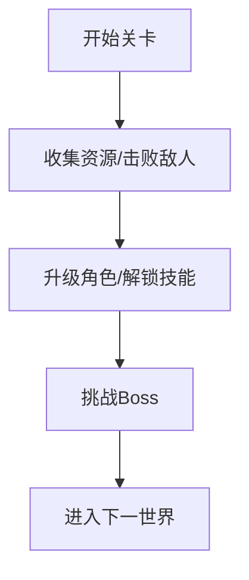

# Open GDD 模板 - AI时代协作游戏设计文档

> **版本**: v1.0.0
> **最后更新**: 2026-02-21
> **状态**: 📝 草稿 / ✅ 生效 / 🔒 冻结
> **修改历史**: 本文件通过Git管理，每次修改需提交PR并记录变更。

---

## 1. 游戏概述 {#overview}

- **类型**: [例如：2D平台跳跃 / 像素风Roguelike]
- **目标平台**: [Steam / 移动端 / 网页]
- **核心一句话**: [用一句话概括游戏]
- **目标玩家画像**: [谁在玩？核心体验是什么？]
- **验收标准**:
  - [ ] 游戏能在目标平台以60fps运行
  - [ ] 核心玩法在5分钟内可上手

---

## 2. 核心循环 {#core-loop}



- 每局时长: [例如：15-20分钟]
- 循环强度: [例如：轻度/中度/重度]
- **验收标准**:
  - [ ] 模拟100次循环后，数值不崩溃
  - [ ] 新手引导完成后，玩家能自然重复循环

---

## 3. 角色与能力 {#character}

### 3.1 主角
- **名称**: [角色名]
- **基础属性**:
```json
{
  "HP": 100,
  "速度": 5.0,
  "跳跃力": 8.0,
  "攻击力": 10
}
```
- **能力列表**:
  - 二段跳（解锁条件：第2关）
  - 冲刺（解锁条件：击败Boss A）
- **资产规格**:
  - 精灵表尺寸：128x128像素，每动作8帧
  - 命名规范：character_walk_01.png
  - 存放路径：/Assets/Sprites/Character/
- **验收标准**:
  - [ ] 所有动作动画过渡自然，无跳帧
  - [ ] 碰撞箱与视觉匹配

### 3.2 敌人
- [按需列出，格式同主角]

---

## 4. 战斗系统 {#combat-system}

- **攻击方式**: [近战/远程/技能组合]
- **判定逻辑**:
  - 攻击框生成时机：动画第3帧
  - 伤害判定持续时间：0.2秒
  - 受击反馈：击退 + 无敌帧0.5秒
- **数值平衡原则**:
  - 玩家攻击力 ≈ 敌人HP的1/3
  - 单次战斗时间控制在30秒内
- **验收标准**:
  - [ ] 攻击判定与动画同步，无延迟
  - [ ] 模拟100次战斗，胜率在50%~70%之间

---

## 5. 经济系统 {#economy}

- **货币类型**:
  - 金币（游戏内获取，用于购买道具）
  - 钻石（内购，用于解锁皮肤）
- **产出与消耗**:
```yaml
金币:
  产出: 每个小怪掉落10，每关宝箱50
  消耗: 道具价格 30~200
钻石:
  产出: 首次通关奖励20，每日登录1
  消耗: 皮肤 60，复活 10
```
- **防数值膨胀策略**:
  - 关卡难度曲线平缓，不强制付费
  - 每日获取上限：500金币
- **验收标准**:
  - [ ] 模拟玩家一周正常游玩，金币收支平衡
  - [ ] 所有付费点对游戏平衡无硬性影响

---

## 6. 关卡设计 {#levels}

- **关卡结构**: [线性/分支/开放]
- **关卡编辑器**: [是否使用内置工具？]
- **资源需求**:
  - 背景层：3层（远景/中景/前景）
  - tileset：16x16，可平铺
  - 特殊物体：弹簧、尖刺、移动平台
- **验收标准**:
  - [ ] 每个关卡至少设计2条隐藏路径
  - [ ] 通关时间与预期偏差不超过20%

---

## 7. 用户界面 (UI) {#ui}

- **主界面元素**:
  - 开始游戏
  - 设置（音量/画质）
  - 角色选择
- **HUD**:
  - 左上角：HP/能量
  - 右上角：金币/钻石
- **字体与尺寸**:
  - 标题：Pixellari-48pt
  - 正文：Pixellari-24pt
- **验收标准**:
  - [ ] 所有按钮点击反馈清晰（变色/音效）
  - [ ] 适配16:9和21:9显示

---

## 8. 美术资产清单 {#assets}

| 类型 | 数量 | 规格 | 工具/AI生成要求 |
|------|------|------|-----------------|
| 角色精灵 | 5套 | 每套8个动作×8帧，128x128 | Layer AI风格训练，人工精修 |
| 背景 | 10张 | 4096x2048，分三层 | Midjourney概念 + Photoshop合成 |
| UI元素 | 30个 | 矢量可缩放 | FLUX.1生成 + Figma优化 |
| 特效序列 | 15组 | 每组长8帧，透明背景 | Komiko + After Effects |
| 图标 | 20个 | 64x64 | a1.art + 人工微调 |

- **存放路径**:
  - /Assets/Sprites/ 精灵图
  - /Assets/Backgrounds/ 背景
  - /Assets/UI/ 界面元素
- **命名规范**: [类型]_[名称]_[用途]_[序号]（例如：bg_forest_parallax_01）
- **验收标准**:
  - [ ] 所有资产符合命名规范
  - [ ] 精灵表已打包图集（TexturePacker自动完成）

---

## 9. 音频资源 {#audio}

- **背景音乐**: [风格/数量/来源]
- **音效列表**:
  - 跳跃：sfx_jump.wav
  - 受伤：sfx_hurt.wav
  - 收集金币：sfx_coin.wav
- **验收标准**:
  - [ ] 音效长度不超过1秒
  - [ ] 支持动态混音（如Boss战时切换BGM）

---

## 10. 技术约束 {#tech-constraints}

- **引擎**: Unity 2022 LTS / Godot 4.3
- **性能目标**:
  - 移动端：稳定30fps
  - PC端：稳定60fps
  - 内存限制: 不超过1.5GB
- **网络依赖**: 仅用于排行榜/云存档（可选）
- **第三方服务**:
  - 崩溃上报：Firebase Crashlytics
  - 数据分析：腾讯MTA
- **验收标准**:
  - [ ] 压力测试1小时无内存泄漏
  - [ ] 低端设备（如iPhone SE）达到性能目标

---

## 11. 开发管线与工具 {#pipeline}

- **版本控制**: Git + Gitea（本地NAS）
- **AI辅助工具**:
  - 美术生成：Layer AI / FLUX.1
  - 代码辅助：CodeBuddy
  - 数值验证：SOON Fx
- **自动化流程**:
  - 每日凌晨3点自动构建（Mac mini集群）
  - 构建后自动运行单元测试（Windows测试机）
  - 测试报告推送飞书
- **验收标准**:
  - [ ] 从代码提交到可玩版本产出 < 30分钟
  - [ ] 自动化测试覆盖率 > 70%

---

## 12. 里程碑与任务 {#milestones}

| 里程碑 | 预计完成时间 | 关键产出 | 负责人 |
|--------|--------------|----------|--------|
| 概念验证 | 第4周 | 可玩的单关卡原型 | 制作人 |
| 垂直切片 | 第8周 | 包含所有系统的完整一关 | 团队 |
| Alpha | 第16周 | 80%内容完成，内部测试 | 团队 |
| Beta | 第20周 | 所有内容完成，社区测试 | 团队 |
| 发布 | 第24周 | 商店上线 | 制作人 |

---

## 13. 附录：修改日志 {#changelog}

- YYYY-MM-DD v1.0.0:
  - 初始版本创建，定义核心循环和经济系统。
  - 批准人：@制作人
- YYYY-MM-DD v1.1.0:
  - 更新战斗系统数值（攻击力从10→12）。
  - 理由：内部测试发现Boss战过难。
  - 批准人：@制作人

---

## 使用指南

1. **固定锚点**: 每个章节的 `{#...}` 就是唯一的ID。在给OpenClaw下指令时，用"更新 `combat-system` 中的攻击力"代替模糊描述。

2. **验收标准**: 每个章节末尾的 `- [ ]` 清单，可被AI或CI工具自动检查。

3. **版本控制**: 将此文件放在NAS的Git仓库中，任何修改都通过PR进行。

4. **与飞书集成**: 将飞书表单的提交自动关联到GDD的特定章节。

---

*模板来源: fuyuan-game-development-flow*
*最后更新: 2026-02-21*

---

## 14. 详细设计规范示例 {#spec-example}

> 本章节提供详细设计规范的格式示例，每个游戏元素都应按照此格式定义

### 武器系统示例 (weapon_id: "chainblade")

```yaml
weapon_id: "chainblade"
定位: "轻武器，高攻速"

输入状态:
  - 轻攻击: 触发3连击
  - 重攻击: 触发范围旋转

判定窗口:
  伤害框: "武器路径上的前120度"
  持续时间: "0.3秒"

资产清单:
  - 动作: "attack_1.fbx, attack_2.fbx, attack_3.fbx"
  - 特效: "slash_red.png, trail_blue.png"

命名规范: "chainblade_${type}_${index}"

技术约束:
  - 接口不许改
  - 存档结构不许动
  - 性能预算: 每帧<0.5ms
```

### 弹珠台元素示例 (ball_id: "default_ball")

```yaml
ball_id: "default_ball"
定位: "玩家控制的唯一弹球"

物理属性:
  - 质量: 0.5
  - 半径: 8像素
  - 弹性: 0.8
  - 摩擦力: 0.3
  - 重力: 980 units/s²

状态机:
  - QUEUED: "队列中，冻结，半透明80%"
  - ACTIVE: "活动中，物理启用，完全不透明"
  - LOST: "丢失，掉出底部"

碰撞检测:
  - 碰撞层: "Layer 1"
  - 碰撞掩码: "Layer 2, Layer 4"
  - 回调: "on_ball_hit(object)"

资产清单:
  - 精灵: "ball_red_16px.png"
  - 碰撞形状: "CircleShape2D, radius=8"

技术约束:
  - 帧同步: 固定60fps
  - 物理步: 16.67ms
  - 最大速度: 1500 units/s
  - 内存预算: <10MB

验收标准:
  - [ ] 弹球不穿透任何障碍物
  - [ ] 碰撞响应<1帧延迟
  - [ ] 1000次碰撞无内存泄漏
```

### 挡板元素示例 (flipper_id: "left_flipper")

```yaml
flipper_id: "left_flipper"
定位: "左侧挡板，负责击打弹球"

物理属性:
  - 类型: "RigidBody2D (frozen)"
  - 质量: 1.0
  - 尺寸: "60x12像素"
  - 弹性: 0.6
  - 摩擦力: 0.5

旋转参数:
  - 静止角度: 0度
  - 最大角度: -45度
  - 旋转速度: 1500度/秒 (修正原20度/秒过慢)
  - 加速度: 5000度/秒²
  - 回弹时间: <0.1秒

输入映射:
  - 按键: "Left Arrow" 或 "A"
  - 响应模式: "pressed (持续)"
  - 激活延迟: 0帧 (<16ms)

碰撞检测:
  - 碰撞层: "Layer 2"
  - 碰撞掩码: "Layer 1 (弹球)"
  - 反弹力: "基于输入强度 + 弹球速度"

资产清单:
  - 精灵: "flipper_blue_60x12.png"
  - 形状: "RectangleShape2D, size=(60,12)"
  - 音效: "sfx_flipper_hit.wav"

技术约束:
  - 响应时间: <1帧
  - 最小激活间隔: 50ms (防止抖动)

验收标准:
  - [ ] 按键到动作响应<16ms
  - [ ] 弹球反弹角度合理(30-60度)
  - [ ] 连续击打无丢失
```

---

*详细规范格式示例版本: v1.0.0*
*更新时间: 2026-02-21*
