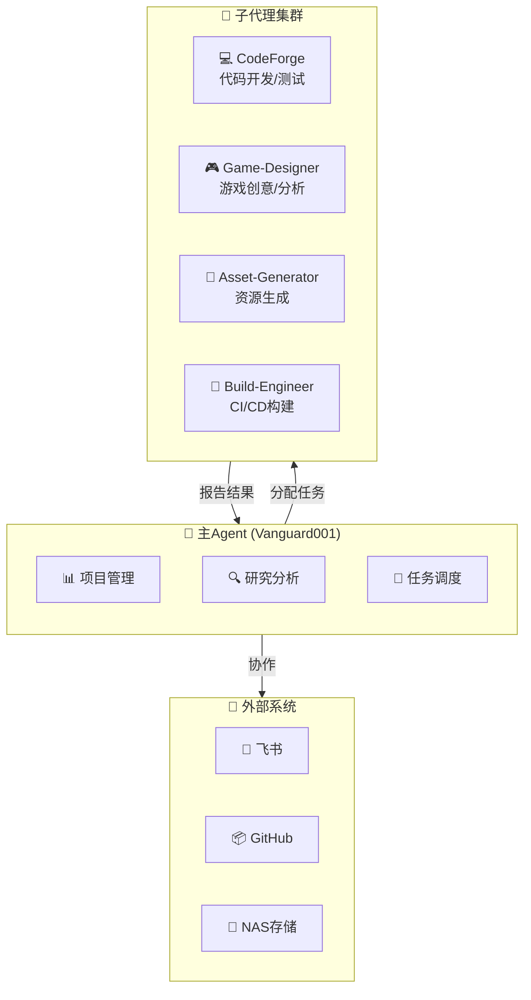
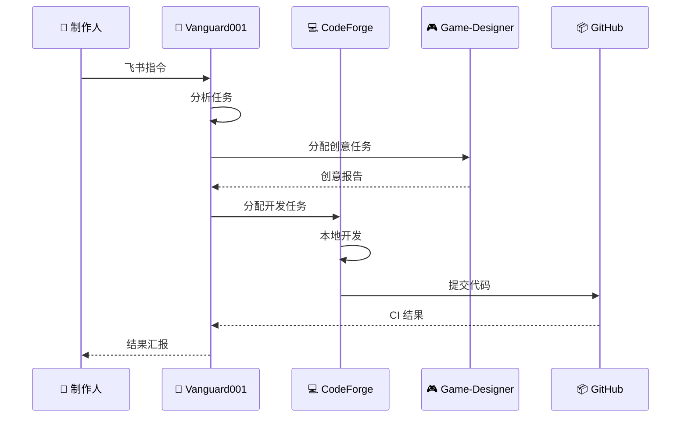

# SubAgent 团队配置

> 一人公司游戏开发生产线 - Agent 团队定义
> 基于 OpenClaw 多代理架构

---

## 🎯 团队架构

---

## 📋 Agent 详细定义

### Vanguard001 (主控)

**角色**: 项目经理 + 研究员 + 协调者

**职责**:
- 接收人类指令（飞书）
- 分析任务需求
- 分配给子代理
- 汇总结果报告

**配置**:
- 模型: MiniMax-M2.5
- 工作空间: /workspace
- 沟通: 飞书 DM

---

### CodeForge (Windows)

**角色**: 软件工程师 + 测试工程师

**职责**:
- 本地 Godot 开发
- 游戏功能实现
- 本地测试截图
- 音效资源收集

**当前任务**:
- PI-PinBall 开发
- 角色系统集成
- 游戏截图捕获

**工作方式**:
- 本地 Godot 编辑器
- 测试后提交 GitHub

---

### Game-Designer

**角色**: 游戏策划 + 创意孵化

**职责**:
- 每日游戏市场研究
- 经典游戏分析解构
- 新游戏创意生成
- 行业趋势分析

**触发**:
- 每日 20:00 Cron
- 生成游戏创意报告

**输出**:
- `/workspace/game/knowledge/`
- `/workspace/game/ideas/`

---

### Asset-Generator (计划中)

**角色**: AI 资源生成专家

**职责**:
- 监听飞书资源需求
- 调用 Midjourney/SD 生成图片
- 调用 ElevenLabs 生成音频
- 存入 NAS 并记录元数据

**待开发**:
- 飞书表单集成
- Midjourney API
- NAS 自动同步

---

### Build-Engineer

**角色**: CI/CD 工程师

**职责**:
- GitHub Actions 维护
- 每日构建触发
- 测试结果收集
- 发布包生成

**当前状态**:
- 游戏 CI/CD 已运行
- 截图同步机制待优化

---

## 🔄 任务流转

---

## 📊 当前任务分配

| 任务 | Agent | 状态 |
|------|-------|------|
| PI-PinBall 核心开发 | CodeForge | 🔄 进行中 |
| 游戏创意研究 | Game-Designer | ✅ 每日运行 |
| 项目管理/协调 | Vanguard001 | ✅ 活跃 |
| CI/CD 维护 | Vanguard001 | ✅ 自动 |
| 资源生成 | Asset-Generator | ⏳ 待开发 |

---

## 🎯 工作流程整合

详见: `game/development-pipeline.md`

**核心原则**:
1. 人类负责创意决策和最终审批
2. Vanguard001 负责任务分配和协调
3. 子代理负责执行具体任务
4. 飞书作为消息中枢

---

*更新时间: 2026-02-21*
