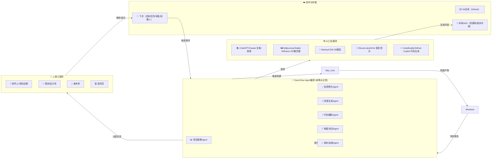

# 一人公司游戏开发生产线

> 基于本地异构集群（树莓派管理 + Mac mini计算 + Windows测试）
> 结合飞书协作与AI生成工具，设计从创意到发布的端到端高效流水线

---

## 🏗️ 整体架构



---

## 🎨 颜色说明

| 颜色 | 角色 | 说明 |
|------|------|------|
| 🟢 **绿色** | 👤 人类工程师 | 创意决策、质量把控、最终审批 |
| 🔵 **蓝色** | 🤖 OpenClaw Agent | 自动化调度、任务分配、流程执行 |
| 🟡 **黄色** | 🛠️ AI工具/服务 | 内容生成、代码补全、构建测试 |
| 🟣 **紫色** | ☁️ 协作平台 | 飞书、Git、NAS等基础设施 |

---

## 📋 七阶段工作流程

### 🟢 阶段1：创意孵化与项目管理启动

| 步骤 | 角色 | 操作 |
|------|------|------|
| 1.1 | 🟢 制作人 | 在飞书撰写游戏创意简报（类型、核心玩法、目标用户） |
| 1.2 | 🔵 创意孵化Agent | 监听飞书文档更新 |
| 1.3 | 🟡 AI (ChatGPT) | 生成3个核心玩法提案、故事背景、竞品分析 |
| 1.4 | 🔵 项目管理Agent | 自动存入飞书文档，@制作人评审 |
| 1.5 | 🟢 制作人 | 确认方向 |
| 1.6 | 🔵 项目管理Agent | 创建飞书项目空间、里程碑日历、任务看板 |

### 🟢 阶段2：概念设计与资源规划

| 步骤 | 角色 | 操作 |
|------|------|------|
| 2.1 | 🟢 策划/美术师 | 填写飞书美术需求表单 |
| 2.2 | 🔵 资源生成Agent | 解析表单，调用AI工具 |
| 2.3 | 🟡 Midjourney | 生成概念图（角色/场景/UI） |
| 2.4 | 🟡 Meshy | 草图转3D白模（可选） |
| 2.5 | 🟡 ElevenLabs | 生成角色语音样本（可选） |
| 2.6 | 🔵 资源生成Agent | 存入NAS，飞书标记待审核 |
| 2.7 | 🟢 美术师 | 挑选/修改，确认入库 |

### 🟢 阶段3：技术设计与开发任务拆分

| 步骤 | 角色 | 操作 |
|------|------|------|
| 3.1 | 🟢 程序+策划 | 编写技术设计文档（架构、模块、数据流） |
| 3.2 | 🔵 代码辅助Agent | 生成项目脚手架、核心类接口、单元测试模板 |
| 3.3 | 🔵 项目管理Agent | 自动创建飞书任务看板，分配给程序员 |
| 3.4 | 🔵 代码辅助Agent | 监听Git仓库，提交时自动代码审查 |

### 🟢 阶段4：资源生产与编码并行

| 步骤 | 角色 | 操作 |
|------|------|------|
| 4.1 | 🟢 美术师 | 飞书提交资源需求 |
| 4.2 | 🔵 资源生成Agent | 调用AI批量生成，存入NAS |
| 4.3 | 🟢 美术师 | 微调后确认，同步到工程 |
| 4.4 | 🟢 程序员 | IDE编码 |
| 4.5 | 🟡 CodeBuddy | 实时补全/建议 |
| 4.6 | 🔵 构建Agent | 触发Mac mini增量编译 |
| 4.7 | 🔵 构建Agent | 编译成功→触发Windows测试机 |

### 🟢 阶段5：集成与每日构建

| 步骤 | 角色 | 操作 |
|------|------|------|
| 5.1 | 🔵 构建Agent | 定时（凌晨）拉取最新代码 |
| 5.2 | 🔵 构建Agent | Mac mini并行构建 |
| 5.3 | 🔵 构建Agent | 部署到Windows测试机 |
| 5.4 | 🔵 测试Agent | 运行自动化测试 |
| 5.5 | 🔵 构建Agent | 生成测试报告→飞书机器人 |
| 5.6 | 🔵 构建Agent | 失败→创建高优任务@程序员 |

### 🟢 阶段6：版本发布与商店上架

| 步骤 | 角色 | 操作 |
|------|------|------|
| 6.1 | 🟢 制作人 | 飞书发起"发布审批"流程 |
| 6.2 | 🔵 发布Agent | 创建release分支并打tag |
| 6.3 | 🔵 发布Agent | Mac mini最终打包 |
| 6.4 | 🔵 发布Agent | 生成更新日志 |
| 6.5 | 🔵 发布Agent | 调用商店API上传（Steam/App Store/Google Play） |
| 6.6 | 🔵 发布Agent | 定期检查审核状态→飞书通知 |

### 🟢 阶段7：运维与社区反馈

| 步骤 | 角色 |操作 |
|------|------|------|
| 7.1 | 🔵 运维Agent | 监控崩溃报告（Crashlytics）→自动分类→创建Bug任务 |
| 7.2 | 🔵 社区Agent | 监听Discord/Telegram→AI提取关键词→飞书汇总 |
| 7.3 | 🔵 运维Agent | 每周生成运营周报→飞书群发送 |

---

## ⚙️ 最小可行工具（MVP）

### Phase 1（立即可启动）
1. **飞书机器人 + OpenClaw基础调度**
   - 树莓派部署飞书自定义机器人
   - 监听关键词触发AI生成

2. **AI资源生成自动化**
   - 轮询飞书表单→调用SD/Midjourney→存入NAS

3. **夜间自动构建 + 飞书通知**
   - Mac mini配置Jenkins/GitHub Actions Runner
   - 凌晨3点构建→飞书推送结果

---

## 📊 当前实现状态

| 组件 | 状态 | 说明 |
|------|------|------|
| 🤖 OpenClaw (Pi) | ✅ 已运行 | 主控调度 |
| 💻 Windows (CodeForge) | ✅ 已配置 | Godot测试 |
| 📲 飞书Bot | ✅ 已配置 | 消息收发 |
| 📦 GitHub CI/CD | ✅ 已运行 | 自动构建 |
| 💡 创意Agent | ✅ 已配置 | 每日游戏创意 |
| 📊 项目管理 | 🔄 开发中 | 任务自动分配 |
| 🎨 资源生成 | ⏳ 待开发 | AI绘图集成 |

---

## 🎯 SubAgent 定义

| Agent | 职责 | 当前状态 |
|-------|------|----------|
| Vanguard001 | 项目管理、研究、任务分配 | ✅ 活跃 |
| CodeForge | 代码开发、本地测试、截图 | ✅ 活跃 |
| Game-Designer | 游戏创意、市场分析 | ✅ 活跃 |
| Asset-Generator | AI资源生成（待开发） | ⏳ 计划中 |
| Build-Engineer | CI/CD、构建测试（现有） | ✅ 可用 |

---

*文档更新时间: 2026-02-21*
*来源: Master Jay 设计*

---

## MCP和Skills生态

### MCP服务器

使用mcporter管理MCP服务器:

```bash
# 列出已配置的MCP
mcporter config list

# 查看MCP工具列表
mcporter list <mcp-name>

# 调用MCP工具
mcporter call <mcp-name>.<tool> key=value
```

### 已安装MCP

| MCP | 功能 |
|-----|------|
| filesystem | 文件系统读写 |
| github | GitHub操作 |
| godot | Godot引擎操作 |

### Skills

Skills位于 `~/.openclaw/skills/` 或 `/workspace/skills/`

安装新Skill: `clawhub install <skill-name>`

---

## 飞书多维表格任务管理

### 表格信息

- **App Token**: `Er2fbGeRSaR1C8seFunc6psnnYb`
- **Table ID**: `tblQWdW1zqzBFZXw`
- **名称**: 世界上最好玩的弹珠机游戏

### 字段

| 字段 | 类型 |
|------|------|
| Task | 文本 |
| Priority | 单选 (Normal/Important/Done) |
| Status | 单选 (Not yet started/Ongoing/Stalled/Completed) |
| Task leader | 人员 |
| Progress notes | 文本 |
| Departments | 多选 |

### 工作流程

1. **创建任务/Bug** → 发现问题时创建
2. **设置状态** → Not yet started → Ongoing → Completed
3. **更新进度** → 在Progress notes中记录

### 常用操作

```python
# 创建任务
feishu_bitable_create_record(app_token, table_id, fields)

# 更新任务状态
feishu_bitable_update_record(app_token, table_id, record_id, fields)

# 查询任务
feishu_bitable_list_records(app_token, table_id)
```

### 规则

- 发现Bug立即创建记录
- 修复完成后及时更新状态
- 任务关联Open GDD章节
- 设置正确的负责人 (Vanguard001/CodeForge)

---

*更新于: 2026-02-21*
